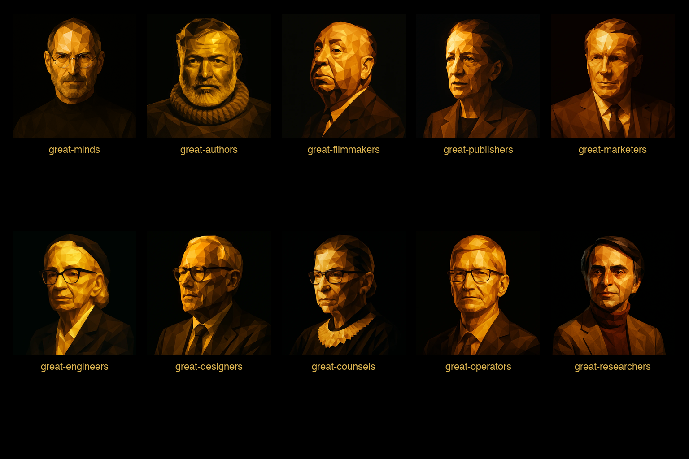

<p align="center">
  
</p>

# Great Minds Constellation

You know what you want the work to sound like. You just don't always have the right mind in the room.

Great Minds Constellation is ten Claude Code plugins — authors, engineers, designers, counsels, operators, researchers, marketers, filmmakers, publishers, founders — each carrying the craft register of the figures who built those disciplines. Hemingway's economy. Carmack's rigor. Ruth Bader Ginsburg's precision. Carl Sagan's capacity for wonder. Not impressions. Not roleplay. Channels you open when the work calls for a particular kind of judgment.

Install only the plugins your project needs. Each one composes with the others. The table below shows what's inside.

## Plugins

| Plugin | Personas | What it's for |
|---|---|---|
| **great-minds** | 10 (Steve Jobs, Elon Musk, Marcus Aurelius, Jensen Huang, Margaret Hamilton, Phil Jackson, Sara Blakely, Maya Angelou, Jony Ive, Rick Rubin) | Founder-class strategy, orchestration, creative direction |
| **great-authors** | 12 (Hemingway, McCarthy, Didion, Baldwin, Morrison, McPhee, Wallace, Orwell, King, Le Guin, Vonnegut, Gottlieb) | Prose craft and editorial work |
| **great-filmmakers** | 12 (directors, writers, craft specialists) | Scene breakdown, shot design, film craft |
| **great-publishers** | 8 (Chip Kidd, Tina Brown, Maxwell Perkins, Jann Wenner, Bob Silvers, Diana Vreeland, Bennett Cerf, George Lois) | Publication form, packaging, editorial direction |
| **great-marketers** | 8 (Ogilvy, Bernbach, Wells Lawrence, Clow, Reeves, Lansdowne Resor, Barton, Sutherland) | Positioning, ad copy, launch composition |
| **great-engineers** | 9 (Carmack, Hopper, Knuth, Torvalds, DHH, Hejlsberg, Eich, Dijkstra, Sandi Metz) | Technical specs, design reviews, engineering craft |
| **great-designers** | 9 (Norman, Zhuo, Spool, Rams, Kare, Cagan, Scher, Hatfield, Tufte) | Design specs, audits, product discovery |
| **great-counsels** | 9 (RBG, Marshall, Scalia, Lessig, Wu, Brandeis, Sunstein, Arendt, Rawls) | Legal memos, policy memos, ethics. **NOT LEGAL ADVICE** — a craft register |
| **great-operators** | 9 (Cook, Grove, Munger, McCord, Deming, Ohno, Horowitz, Walton, Kelleher) | Operating plans, process reviews, operational craft |
| **great-researchers** | 9 (Sagan, Gould, Roach, Sacks, Gawande, Diamond, Wilson, Skloot, Caro) | Studies, peer reviews. **NOT ACADEMIC ADVICE** — a craft register |

## Installation

Add the marketplace once:

```bash
claude /plugin marketplace add github:sethshoultes/great-minds-constellation
```

Then install only the plugins your project needs:

```bash
claude /plugin install great-minds@great-minds-constellation
claude /plugin install great-engineers@great-minds-constellation
# ... etc
```

## Per-project enablement

Each plugin you install loads ~150-250 tokens of agent metadata into every Claude Code session at startup. With all 10 plugins enabled, that's ~19,000 tokens per session — even when you only need 2-3 personas for the project at hand.

**The architectural rule: enable plugins per-project, not globally.**

In `~/.claude/settings.json`, set the great-* plugins to `false` by default:

```json
{
  "enabledPlugins": {
    "great-minds@great-minds-constellation": false,
    "great-engineers@great-minds-constellation": false,
    "great-authors@great-minds-constellation": false
  }
}
```

Then in each project's `.claude/settings.json`, enable only what that project needs:

```json
{
  "enabledPlugins": {
    "great-minds@great-minds-constellation": true,
    "great-engineers@great-minds-constellation": true,
    "great-designers@great-minds-constellation": true
  }
}
```

The only project that should pay the full constellation tax is the one orchestrating the constellation. Casual sessions stay lean.

## Cross-platform compatibility

The constellation ships in Claude Code's plugin format, but the persona files and most skills follow the [Agent Skills](https://agentskills.io) open standard — the SKILL.md format Anthropic released and ~37 agent clients have adopted (Cursor, Gemini CLI, Goose, OpenHands, OpenCode, Mistral Vibe, OpenAI Codex, Roo Code, Emdash, and others). What this means in practice depends on which piece you're trying to use.

**Portable across skills-compatible agent runtimes:**

- **All persona files** (`plugins/<plugin>/agents/*.md`) — these are pure markdown with frontmatter; any client that loads sub-agent personas with the SKILL.md metadata convention can use them directly.
- **Channel skills** — `/<plugin>-channel <persona>` style skills load a named persona into the current conversation. They're instruction-only and rely on no specific tool harness.
- **Spec / scaffold skills** — `<plugin>-project-init`, `<plugin>-write-spec`, `<plugin>-design-review` and similar skills use only Read, Write, and Bash. Any client that exposes those primitives can run them.

**Claude-Code-coupled (won't run cleanly elsewhere yet):**

- **Orchestration skills that dispatch sub-agents** — `/team-build`, `/agency-launch`, `/agency-execute`, `/constellation-start`, and any skill that internally calls Claude Code's `Agent` tool to dispatch a `<plugin>:<persona>` sub-agent in parallel. These depend on Claude Code's specific Agent dispatch protocol.
- **Plugin marketplace + per-project enablement** — `.claude/settings.json` `enabledPlugins` is a Claude Code concept. Other clients have their own enablement models.

**Mental model:** the *content* of the constellation (persona instructions + instruction-only skills) is platform-portable. The *orchestration glue* that dispatches sub-agents in parallel is Claude-Code-coupled. If you port the constellation to a different runtime, the personas come with you; the orchestration patterns may need re-implementing in that runtime's idiom.

For the deeper architectural rationale, see the brain learning [cross-model-persona-portability](https://github.com/sethshoultes/brain) — recipe #2 (book proposal) ran end-to-end on Kimi K2.6:cloud through Claude Code's Agent tool, demonstrating that the personas survive cross-model orchestration. Whether they survive cross-*runtime* orchestration is a separate, untested question.

## Migration from standalone plugin marketplaces

Each plugin previously lived as its own standalone marketplace (e.g., `sethshoultes/great-minds-plugin`). Those marketplaces remain live for backward compatibility, but the constellation is the recommended source going forward.

To migrate an existing install:

1. `claude /plugin marketplace remove sethshoultes-great-minds-plugin`
2. `claude /plugin marketplace add github:sethshoultes/great-minds-constellation`
3. `claude /plugin install great-minds@great-minds-constellation`

Both can coexist — there's no forced migration. Pick the constellation source for new projects.

## Per-plugin documentation

Each plugin's `plugins/<name>/README.md` (and `MANUAL.md`, `ORCHESTRATING.md` where present) is the canonical documentation for that plugin's personas, skills, and dispatch patterns.

## Status

| Plugin | Version |
|---|---|
| great-minds | 1.4.0 |
| great-authors | 1.6.0 |
| great-filmmakers | 1.10.0 |
| great-publishers | 0.1.0 |
| great-marketers | 0.1.0 |
| great-engineers | 0.1.0 |
| great-designers | 0.1.0 |
| great-counsels | 0.1.0 |
| great-operators | 0.1.0 |
| great-researchers | 0.1.0 |

## License

MIT — see [LICENSE](./LICENSE).

## Author

Built by [Seth Shoultes](https://github.com/sethshoultes).
